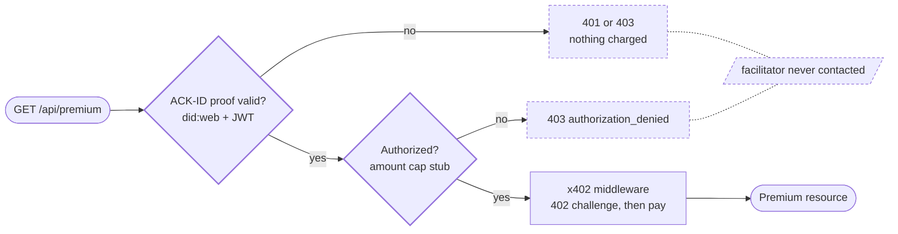

# x402-ack-id-demo

An [x402](https://github.com/x402-foundation/x402) seller that verifies an [ACK-ID](https://www.agentcommercekit.com) identity proof before any payment logic runs, then settles USDC on Base Sepolia. No verified identity, no payment. Tests assert the settlement adapter is never invoked for rejected identities.



Unverified identities (missing, malformed, expired, mismatched) stop at step 1
with 401/403, before any payment logic runs. A replayed proof is different: it
carries a real payment, so it is caught at the payment hook after the
facilitator verifies and before anything settles.
[docs/architecture.md](docs/architecture.md) explains why the ordering holds.

## Quickstart

Node >= 22.13. This repo pins its package manager (`packageManager: pnpm@11`),
so run `corepack enable` once and pnpm will match it.

```sh
pnpm install
cp .env.example .env
```

The rejected-identity demos need no keys or funds:

```sh
pnpm demo:missing-identity
pnpm demo:mismatched-identity
pnpm demo:expired-identity
```

Each prints the outcome and the settlement-adapter call counts:

```
Seller:   http://localhost:4021 (did:web:localhost%3A4021)
Network:  eip155:84532, price $0.001
Scenario: missing-identity

Buyer DID:    did:web:localhost%3A4022
HTTP status:  401
Response:     {"error":"identity_missing","message":"No identity proof provided"}

Settlement adapter calls: verify=0 settle=0

PASS: identity rejected before any payment; settlement adapter never invoked.
```

`verify=0 settle=0` is the claim: the payment infrastructure was never asked
anything for this request.

For the real payment against the Catena sandbox:

1. **Catena sandbox account.** Sign in at [app.catena.com](https://app.catena.com), open (or create) a sandbox agent, and copy the account's **Base Sepolia USDC deposit address** (the console shows it; the API's `get_deposit_address` returns the same value). Set it as `SELLER_PAY_TO_ADDRESS` in `.env`: this is where the payment lands.
2. **Buyer wallet.** `pnpm wallet:new`, then fund the printed address with Base Sepolia USDC at [faucet.circle.com](https://faucet.circle.com) (select Base Sepolia). No ETH needed; transfers are gasless EIP-3009 and the facilitator pays gas. Set the printed key as `BUYER_EVM_PRIVATE_KEY`. Testnet only: never put a key that holds real funds in `.env`.
3. `pnpm demo:valid` completes a ~$0.001 USDC payment, then reads the chain over a public RPC to confirm the exact amount reached your Catena deposit address (the "Loop closed" line). The deposit also appears in the Catena console as a completed incoming transaction.

Runs against public surfaces only: the sandbox account as the receiving bank, a
public facilitator, and a public RPC for confirmation. No Catena CLI or SDK.

The `@x402/*` packages are pinned to exact versions, no `^`. They implement the
wire protocol on the money path, so a minor bump is something to adopt
deliberately and test, not to pick up silently on a fresh install.

## Commands

| Command                                             | Result                                                    |
| --------------------------------------------------- | --------------------------------------------------------- |
| `pnpm demo:valid`                                   | Verified identity, real USDC settlement, protected result |
| `pnpm demo:missing-identity`                        | 401 before any payment logic                              |
| `pnpm demo:mismatched-identity`                     | 403 before any payment logic                              |
| `pnpm demo:expired-identity`                        | 401 before any payment logic                              |
| `pnpm seller`                                       | Seller service standalone                                 |
| `pnpm wallet:new`                                   | Throwaway Base Sepolia wallet for the buyer               |
| `pnpm test` / `lint` / `typecheck` / `format:check` | Checks                                                    |

## Layout

- [src/identity.ts](src/identity.ts): ACK-ID proof creation and verification, nonce replay cache
- [src/seller/server.ts](src/seller/server.ts): identity gate → authorization stub → x402 middleware → handler
- [src/seller/authorization.ts](src/seller/authorization.ts): the injectable authorization stub (amount cap)
- [src/buyer/buyer.ts](src/buyer/buyer.ts): scripted buyer, one entrypoint per scenario
- [src/onchain.ts](src/onchain.ts): on-chain confirmation that the USDC reached the Catena account
- [test/ordering.test.ts](test/ordering.test.ts): proof that rejected identities never reach settlement

## License

MIT
